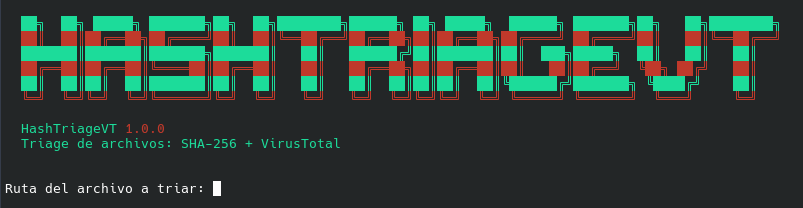

<div align="center">

# HashTriageVT

### Automated File Triage for Linux using SHA-256 and VirusTotal



**Version 1.0.0**

</div>

---

## Overview

**HashTriageVT** is a Linux command-line tool for automated initial file triage.

The tool identifies a local file by calculating its **SHA-256 hash** and then queries the **VirusTotal API v3** to determine whether that hash already has analysis information available.

It is designed as a lightweight defensive security utility for situations where an analyst needs a quick reputation check of a file without uploading the file itself.

The project was developed and tested with **CachyOS**, using the `pacman` package manager for dependency installation.

### What it does

1. Checks and installs required dependencies.
2. Checks whether a VirusTotal API key has already been configured.
3. If no key exists, asks the user for one and validates it against VirusTotal.
4. Stores the API key encrypted with **GPG using AES-256**.
5. Requests the path of a local file.
6. Calculates the file's SHA-256 hash in 4 KB blocks.
7. Queries VirusTotal API v3 using the hash.
8. Interprets the API response and analysis statistics.
9. Displays a structured triage report.
10. Optionally saves the report as a timestamped `.txt` file.

---

## Main characteristics

- SHA-256 file identification
- VirusTotal API v3 integration
- No hardcoded API key
- Encrypted API key storage using GPG/AES-256
- Restrictive `0600` permissions on the encrypted key file
- GPG-protected API key with user-supplied passphrase
- API key validation before it is stored
- File hashing performed locally
- File read in 4 KB blocks
- HTTP error handling for VirusTotal responses
- Detection statistics extraction
- Detection-engine reporting
- Known file-name extraction from VirusTotal
- Human-readable text reports
- Timestamped report filenames
- Interactive terminal interface
- Designed for CachyOS / Arch Linux environments

---

## Security model

Credential handling is an important part of HashTriageVT.

The VirusTotal API key is **not embedded in the source code** and is not intentionally stored as a plaintext configuration file.

The configuration file is stored at:

```text
~/.config/hashtriagevt/api.key.gpg
```

The directory is created automatically when the API key is configured.

### API key lifecycle

The key follows this general flow:

```text
                 First configuration
                        |
                        v
              User enters API key
                        |
                        v
             HashTriageVT validates it
                against VirusTotal
                        |
                        v
              GPG symmetric encryption
                    AES-256
                        |
                        v
          ~/.config/hashtriagevt/api.key.gpg
                        |
                        v
               chmod 0600
```

When the tool needs the key:

```text
        api.key.gpg
             |
             v
        GPG decrypt
             |
             v
       Passphrase prompt
             |
             v
      API key in process
             |
             v
    HTTPS request to VirusTotal
```

### Important security details

#### No hardcoded credential

The VirusTotal API key is not present in the Python source code.

The program obtains the key interactively during initial configuration and stores only the encrypted GPG file.

#### GPG symmetric encryption

The key is encrypted using:

```text
AES-256
```

through GPG's symmetric encryption mode.

The encryption passphrase is supplied by the user and is not stored by HashTriageVT.

#### File permissions

After the encrypted key file is created, the program attempts to apply:

```text
0600
```

This restricts access to the file to its owner.

#### Passphrase handling

When the key is required, GPG is invoked to decrypt it. The script does not implement its own password storage mechanism. Depending on the local GPG agent configuration, the passphrase may be requested interactively or may already be available through the agent cache.

If decryption fails, the user can retry. The script can also terminate the `gpg-agent` process before retrying so that GPG requests the passphrase again.

#### HTTPS communication

The API key is sent to VirusTotal through the API request's `x-apikey` HTTP header. The request is made to the HTTPS VirusTotal API endpoint.

#### What is and is not protected

HashTriageVT protects the API key against being stored directly in the source code or as an ordinary plaintext key file.

However, once the key is decrypted, it necessarily exists temporarily in the running Python process so that the HTTP request can authenticate against VirusTotal. This is normal for an API client and should not be confused with persistent plaintext storage.

Also note that the initial interactive `input()` prompt displays typed characters in the terminal. The key is therefore not hidden during initial entry. The security measure implemented by the project is focused on **not hardcoding or persistently storing the key in plaintext**.

---

## Requirements

### Operating system

HashTriageVT was created for:

- CachyOS
- Arch Linux and Arch-based distributions using `pacman`

The current automatic dependency installation logic specifically uses `pacman`, so other Linux distributions may require manual dependency installation or adaptation of the installer logic.

### Software requirements

The program checks for:

- Python 3
- `requests`
- `gnupg`
- `pinentry`

On CachyOS / Arch Linux, the script can install the required packages when they are missing.

The relevant packages are:

```bash
sudo pacman -S python-requests
sudo pacman -S gnupg
sudo pacman -S pinentry
```

---

## Installation

Clone the repository from GitHub and enter its directory:

```bash
git clone <repository-url>
cd HashTriageVT
```

Make the script executable:

```bash
chmod +x HashTriageVT.py
```

Run it:

```bash
./HashTriageVT.py
```

Alternatively:

```bash
python3 HashTriageVT.py
```

---

## First execution

On the first execution, HashTriageVT checks whether the encrypted API key exists:

```text
~/.config/hashtriagevt/api.key.gpg
```

If it does not exist, the program starts the initial configuration process.

### Step 1 — VirusTotal API key

The user is asked to enter a VirusTotal API key.

The key is validated through a test request before it is stored.

If VirusTotal rejects the key, the program allows the user to retry.

### Step 2 — GPG passphrase

After validation, GPG requests the passphrase used to protect the encrypted API key.

The resulting encrypted file is stored as:

```text
~/.config/hashtriagevt/api.key.gpg
```

After this configuration, subsequent executions use the existing encrypted key.

---

## Usage

Start the program:

```bash
./HashTriageVT.py
```

The tool asks:

```text
Ruta del archivo a triar:
```

Enter the path of the file you want to analyze.

Examples:

```text
/home/user/Downloads/sample.exe
```

```text
~/Downloads/sample.exe
```

Environment variables such as `$HOME` are also expanded.

The program then:

```text
File
 |
 +--> SHA-256 calculation
 |
 +--> VirusTotal API v3 query
 |
 +--> Response interpretation
 |
 +--> Triage report
```

---

## SHA-256 calculation

The file is read locally in **4 KB blocks**:

```python
for bloque in iter(lambda: f.read(4096), b""):
    sha.update(bloque)
```

This avoids loading the complete file into memory at once.

The resulting digest is used as the identifier for the VirusTotal lookup.

### Important

HashTriageVT does **not** upload the local file as part of this triage workflow.

The VirusTotal request is performed using the calculated SHA-256 hash.

---

## VirusTotal API integration

HashTriageVT uses the **VirusTotal API v3** file endpoint:

```text
https://www.virustotal.com/api/v3/files/<SHA256>
```

The API key is supplied through:

```http
x-apikey: <API_KEY>
```

### API response handling

The program distinguishes between several response conditions:

| HTTP response | Internal status | Meaning |
|---:|---|---|
| `200` | `ok` | Hash found and information returned |
| `404` | `no_encontrado` | Hash not present in VirusTotal |
| `401` | `api_invalida` | API key rejected |
| `429` | `limite` | API rate limit reached |
| Network exception | `error_red` | Network/request failure |
| Other HTTP code | `error` | Unexpected API response |

---

## VirusTotal rate limiting

The public VirusTotal API has request limits.

When the API responds with:

```text
HTTP 429
```

HashTriageVT identifies the condition and informs the user that the API request limit has been reached.

The exact quota depends on the VirusTotal API/account conditions applicable to the key being used.

The program does not attempt to bypass the rate limit.

---

## Report generation

After the VirusTotal query, HashTriageVT builds a human-readable report.

The report includes:

```text
Tool name and version
File name
Absolute path
File size
Modification date
Triage date
SHA-256
VirusTotal statistics
VirusTotal file names
Detection engines
Final triage verdict
```

Example structure:

```text
================================================================
  REPORTE DE TRIAGE — HashTriageVT v1.0.0
================================================================
Nombre del archivo : sample.exe
Ruta absoluta      : /home/user/sample.exe
Tamaño             : ...
Fecha de modif.    : ...
Fecha del triage   : ...
Hash SHA-256       : ...
----------------------------------------------------------------
RESULTADO VIRUSTOTAL:
  Detecciones maliciosas : ...
  Sospechosas            : ...
  No detectadas          : ...
  Inofensivas            : ...

VEREDICTO: ...
================================================================
Fin del reporte — HashTriageVT
================================================================
```

---

## Detection statistics

When VirusTotal returns analysis information, the tool extracts:

- `malicious`
- `suspicious`
- `undetected`
- `harmless`

It also calculates the total represented by these categories and displays the values in the report.

If one or more engines classify the file as `malicious` or `suspicious`, those engines are included in the report.

---

## File names reported by VirusTotal

HashTriageVT also reads the `names` field returned by VirusTotal and displays up to five names associated with the analyzed hash.

This can provide additional context when the same file has been observed under different filenames.

---

## Interpreting the results

HashTriageVT is a **triage and reputation lookup tool**, not a complete malware analysis platform.

A positive detection should be treated as an indicator requiring further investigation.

Likewise:

```text
0 detections
```

does not prove that a file is completely safe.

A file can be new, previously unseen, obfuscated, or simply not detected by the engines involved in the available analysis.

### Unknown hash

If VirusTotal returns:

```text
404
```

the tool reports that the hash was not found in VirusTotal.

This means that VirusTotal has no existing file record for that hash. It should **not** be interpreted as proof that the file is benign.

---

## Saving reports

At the end of the analysis, the program asks whether the report should be saved:

```text
¿Guardar el reporte en un .txt? [s/N]:
```

If accepted, a timestamped filename is generated:

```text
HashTriageVT_<archivo>_<timestamp>.txt
```

Example:

```text
HashTriageVT_sample_20261007_022000.txt
```

The report is saved in the current working directory.

> Reports can contain the local absolute path of the analyzed file. Consider this before sharing reports publicly.

---

## Project structure

The current script is organized into several logical sections:

```text
HashTriageVT.py
│
├── Basic utilities
│   ├── clear_screen()
│   ├── pausa()
│   └── mostrar_logo()
│
├── Dependency management
│   └── asegurar_dependencias()
│
├── API key management
│   ├── api_key_existe()
│   ├── validar_api_key()
│   ├── guardar_api_key()
│   └── obtener_api_key()
│
├── File triage
│   ├── calcular_sha256()
│   ├── info_archivo()
│   └── consultar_virustotal()
│
├── Reporting
│   └── construir_reporte()
│
└── Main execution flow
    └── main()
```

---

## Execution flow

The complete runtime workflow can be summarized as:

```text
                 ┌─────────────────────┐
                 │   Start program     │
                 └──────────┬──────────┘
                            │
                            v
                 ┌─────────────────────┐
                 │ Check dependencies  │
                 └──────────┬──────────┘
                            │
                            v
                 ┌─────────────────────┐
                 │ API key exists?     │
                 └───────┬─────┬───────┘
                         │     │
                       No│     │Yes
                         │     │
                         v     │
                ┌────────────┐ │
                │ Ask +      │ │
                │ validate   │ │
                │ API key    │ │
                └─────┬──────┘ │
                      │        │
                      v        │
                ┌────────────┐ │
                │ GPG AES-256│ │
                │ encryption │ │
                └─────┬──────┘ │
                      │        │
                      └────┬───┘
                           │
                           v
                 ┌─────────────────────┐
                 │ Ask for file path   │
                 └──────────┬──────────┘
                            │
                            v
                 ┌─────────────────────┐
                 │ Calculate SHA-256   │
                 │ locally             │
                 └──────────┬──────────┘
                            │
                            v
                 ┌─────────────────────┐
                 │ Query VirusTotal    │
                 │ API v3              │
                 └──────────┬──────────┘
                            │
                            v
                 ┌─────────────────────┐
                 │ Parse VT response   │
                 └──────────┬──────────┘
                            │
                            v
                 ┌─────────────────────┐
                 │ Build triage report │
                 └──────────┬──────────┘
                            │
                            v
                 ┌─────────────────────┐
                 │ Display / save .txt │
                 └─────────────────────┘
```

---

## Technologies

| Technology | Purpose |
|---|---|
| Python 3 | Main application |
| `hashlib` | SHA-256 calculation |
| `requests` | VirusTotal API communication |
| GnuPG | API key encryption/decryption |
| AES-256 | Symmetric encryption of stored API key |
| `pacman` | Dependency installation on CachyOS/Arch |
| VirusTotal API v3 | Hash reputation and analysis information |

---

## Security considerations

HashTriageVT was designed around several basic defensive security principles:

### Credential separation

The API credential is kept outside the Python source code.

### Encryption at rest

The stored API key is encrypted rather than saved as a plaintext configuration value.

### Least-access permissions

The encrypted key file is assigned restrictive permissions:

```text
0600
```

### Local hashing

The file is hashed locally before the VirusTotal lookup.

### No execution of the analyzed file

HashTriageVT does not execute the file being analyzed.

### No attempt to bypass API restrictions

The tool respects the response returned by VirusTotal, including HTTP `429` rate-limit responses.

---

## Limitations

HashTriageVT intentionally focuses on **initial triage**.

It does not currently perform:

- Dynamic malware execution or sandboxing
- Static PE/ELF reverse engineering
- YARA scanning
- Strings extraction
- Entropy analysis
- Process monitoring
- Network behavior analysis
- Persistence analysis
- Full forensic acquisition
- Automatic quarantine
- Automatic file deletion
- Uploading the file to VirusTotal

Its purpose is to provide a quick, low-overhead reputation lookup based on a file's SHA-256.

---

## Privacy considerations

The analyzed file remains local during the hashing stage.

However, the SHA-256 hash is sent to VirusTotal as part of the API lookup.

The generated local report may contain:

- Filename
- Absolute local path
- File size
- Modification date
- SHA-256
- VirusTotal analysis information

Review the report before sharing it publicly.

---

## Project status

**Version:** `1.0.0`

HashTriageVT is currently a functional first release focused on automated hash-based file triage for CachyOS / Arch Linux environments.

---

## Future improvements

Possible future versions could add:

- Command-line arguments
- Batch directory analysis
- JSON report generation
- CSV export
- Configurable output directory
- Additional VirusTotal metadata
- More granular result classification
- Cross-distribution dependency handling
- Optional logging
- Integration with other defensive security tools

---

## Disclaimer

HashTriageVT is intended for **defensive security analysis, incident triage, research, and educational purposes**.

The tool does not guarantee that a file is safe or malicious based solely on VirusTotal results. Analysis results should be interpreted in context and, when necessary, followed by additional static or dynamic analysis.

---

## Author

**Luciano Letard**

Cybersecurity student and developer focused on defensive security, Linux, SOC tooling, and practical security automation.

---

## License

This project is licensed under the **MIT License**. See the [LICENSE](LICENSE) file for details.
